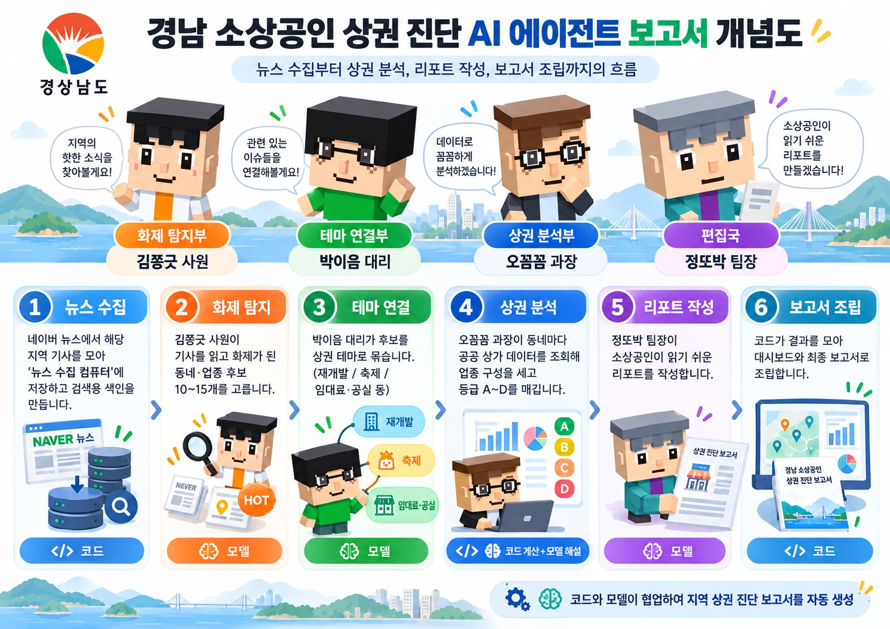

# 경남 소상공인 상권 진단 AI 에이전트 팀

2026 제4회 경남 AI·SW 경진대회 출품작

경상남도 소상공인을 위한 **상권 진단 서비스**입니다. 지역과 업종을 고르면 AI 직원 4명이 차례로 일해, 이번 주 뉴스에서 화제가 된 동네를 찾고 공공 상가 데이터로 그 동네의 상권을 진단해 리포트로 만들어 줍니다.

---

## 만든 곳

**넥스토폴로직스 (NexTopologix)** 가 기획 · 개발 · 배포했습니다.

| | |
|---|---|
| **상호** | 넥스토폴로직스 (NexTopologix) |
| **대표** | 김상호 |
| **주소** | 경상남도 창원시 성산구 비음로27번길 46-14, 202호 (사파동) |
| **전화** | 010-2533-4642 |
| **이메일** | ksh4642@nextopologix.com |

> 이 소프트웨어의 저작권은 넥스토폴로직스에 있습니다.
> **2026 제4회 경남 AI·SW 경진대회** 출품을 위해 배포한 것으로,
> 대회 심사 목적 외의 복제 · 배포 · 상업적 이용은 사전 협의가 필요합니다.

---

## 실행 방법

### 1. 준비물

- **Python 3.11 이상** — 설치할 때 "Add Python to PATH"를 꼭 체크하세요
- 인터넷 연결

### 2. 실행

`run.bat` 을 더블클릭하세요.

처음 한 번은 가상환경을 만들고 필요한 패키지를 받습니다. 약 1.8GB라 **5~10분쯤 걸립니다.** 끝나면 브라우저가 저절로 열립니다.

```
http://localhost:8766
```

### 3. API 키 넣기

처음 받은 상태는 **보고서와 기사가 하나도 없는 깨끗한 상태**입니다. 상담소에서 의뢰하면 AI 직원 4명이 기사를 모으고 분석해 첫 보고서를 만듭니다.
의뢰하려면 `.env` 파일을 열어 아래 키를 채우고 `run.bat` 을 실행하세요(이미 실행 중이면 껐다 다시 켜야 반영됩니다).

키 없이도 상담소·사무실·직원 소개(전문자료·지식 그래프) 화면은 둘러볼 수 있습니다.

| 키 | 쓰는 곳 | 발급처 |
|---|---|---|
| `DEEPSEEK_API_KEY` · `ANTHROPIC_API_KEY` · `OPENAI_API_KEY` · `GEMINI_API_KEY` | LLM 모델. 쓰려는 공급사의 키를 넣고, 직원별 모델은 '모델' 탭에서 고릅니다 | 각 공급사 |
| `NAVER_CLIENT_ID`, `NAVER_CLIENT_SECRET` | 지역 뉴스 검색. 네이버 클라우드(NCP)에서 받은 키면 `NAVER_AUTH=ncp` 도 넣습니다 | developers.naver.com 또는 NCP |
| `SEMAS_API_KEY` | 소상공인시장진흥공단 상가정보 | data.go.kr |
| `EMBED_REMOTE_URL` · `EMBED_REMOTE_TOKEN` | (선택) 검색용 임베딩 계산을 GPU 장비로 넘길 때. 기본은 이 PC 가 계산하고, 주소는 보관만 했다가 화면에서 [젯슨] 을 눌러야 그 장비로 계산 | 장비 설치 시 정한 값 |

한 번 실행에 **7~15분**, 모델 호출 **약 36회**가 듭니다.

---

## 어떻게 작동하나

### 전체 흐름



앞 직원의 결과가 다음 직원의 입력으로 들어갑니다. **검증을 통과한 결과만** 다음으로 넘어갑니다.

### AI 직원 4명

| 순서 | 이름 | 맡은 일 | 쓰는 도구 |
|---|---|---|---|
| 1 | **김쫑긋** 사원 | 관측 기간의 지역 뉴스에서 화제가 된 동네·업종 후보를 찾습니다 | 뉴스 수집 컴퓨터, 화제 점수, 자료 검색, 지식 그래프 |
| 2 | **박이음** 대리 | 화제 동네를 상권 테마(재개발·축제·공실 등)로 묶습니다 | 뉴스 수집 컴퓨터, 자료 검색, 지식 그래프 |
| 3 | **오꼼꼼** 과장 | 공공 상가 데이터로 업종 구성을 세고 등급(A~D)을 매깁니다 | 상가정보 조회, 뉴스 수집 컴퓨터, 자료 검색, 지식 그래프 |
| 4 | **정또박** 팀장 | 소상공인이 읽을 이번 주 상권 리포트를 씁니다 | 자료 검색, 지식 그래프 |

직원 4명 모두 **DeepSeek** 모델을 씁니다. 화면에서 다른 모델로 바꿀 수 있습니다.

### 숫자와 판단을 나눕니다

이 서비스의 핵심은 **숫자를 모델이 지어내지 않는다**는 점입니다.

- **점포 수, 업종 비율, 업종 집중도, 등급** → 소상공인시장진흥공단 공공 데이터를 **코드가 직접 세어** 계산합니다
- **어느 동네가 화제인지, 왜 그런지, 무엇을 조심할지** → 모델이 판단하고 문장을 씁니다

그래서 보고서의 숫자는 검증할 수 있고, 모델이 바뀌어도 숫자는 달라지지 않습니다.

### 직원이 자료를 찾는 방법

각 직원은 자기 전문 자료를 갖고 있고, 두 가지 방법으로 찾아 읽습니다.

- **자료 검색 (RAG)** — 수집한 기사와 전문 자료를 의미로 찾습니다. 임베딩 모델 `BAAI/bge-m3` 를 씁니다
- **지식 그래프** — 행정구역, 상권 테마, 등급 기준처럼 **관계가 중요한 지식**을 그래프로 담아 두고 따라갑니다

### 화면 셋

| 화면 | 하는 일 |
|---|---|
| **상담소** | 경상남도 › 시·군 › 구 › 동 순서로 지역을 고르고, 업종과 관측 기간(1주·2주·30일)을 정해 의뢰합니다 |
| **사무실** | AI 직원 4명이 일하는 모습을 말풍선으로 보여 줍니다. 뉴스 수집 컴퓨터 5대와 지난 실행 기록도 여기 있습니다 |
| **열람실** | 완성된 보고서를 포스터로 전시합니다. 포스터를 누르면 지도·업종 구성·등급 근거·소상공인 조언·대표 기사가 펼쳐집니다 |

### 다루는 지역

창원시 · 진주시 · 김해시 · 양산시 · 거제시 (5개 시)

동네 목록과 좌표, 업종 분류는 모두 공공 데이터에서 실측한 값입니다.

---

## 같이 들어 있는 것

| | |
|---|---|
| 직원 4명 | 성격·업무 지시문, 판단 기준서·지식 표(검색용 색인 포함), 지식 그래프 |
| 지역 정보 | 경남 5개 시의 구·동 목록과 좌표, 업종 분류 |
| 상가 데이터 캐시 | 소상공인시장진흥공단 상가정보(키 없이도 상권 조회가 되도록) |

보고서·실행 기록·수집 기사는 **비어 있는 상태**로 넣었습니다. 의뢰하면 그 지역·기간의 기사를 네이버에서 모아 채웁니다.
`.venv` 폴더(파이썬 패키지)는 용량 때문에 빼 두었습니다. `run.bat` 이 처음 실행할 때 자동으로 만듭니다.

---

## 더 알아보기

- `docs/서비스_설명.md` — 서비스 구조와 폴더 안내
- 소스 코드: `app/` (서버) · `static/` (화면)
